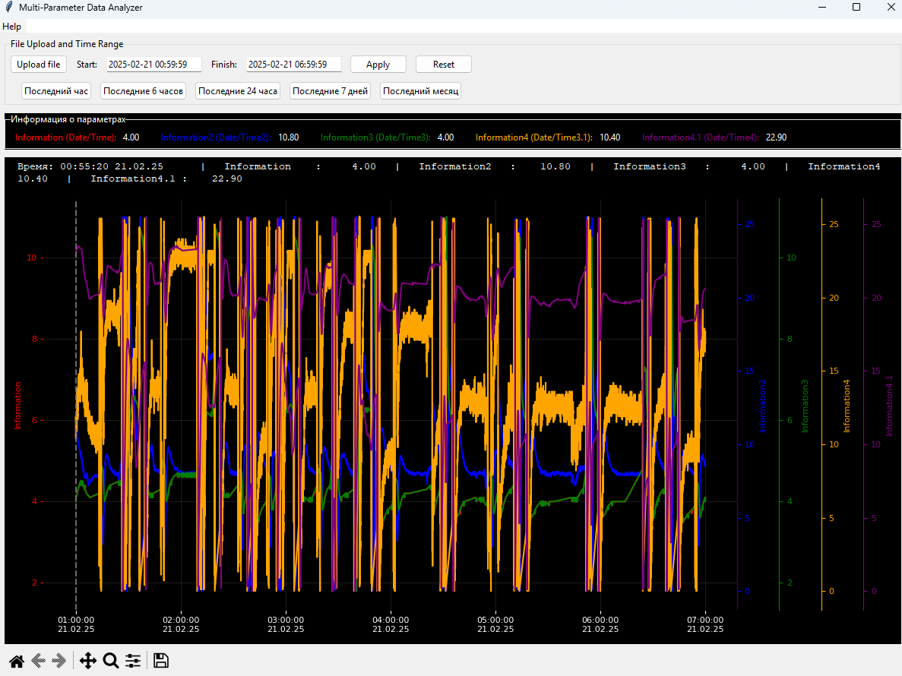
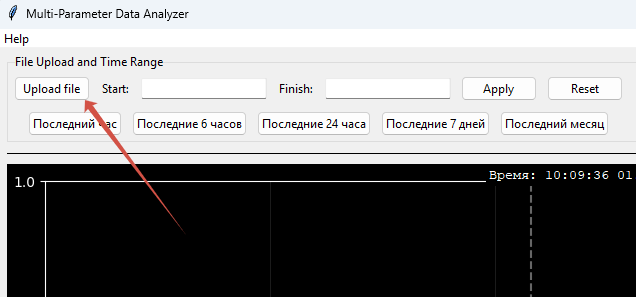
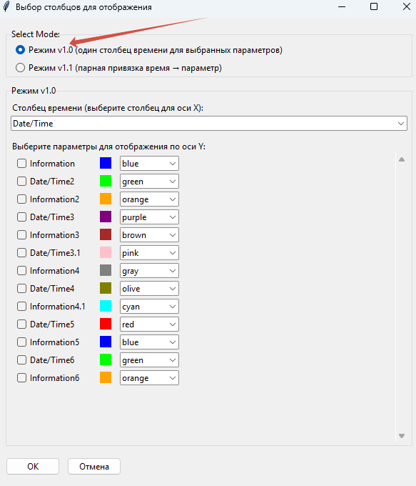
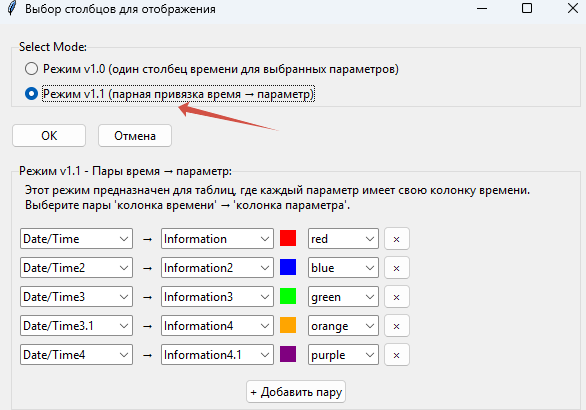
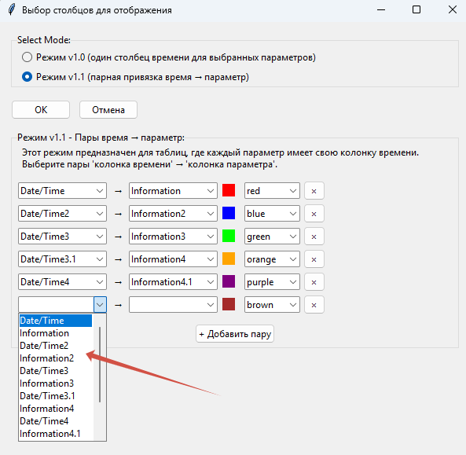

# Руководство пользователя Multi-Parameter Data Analyzer v1.1 (EXE для Windows)

Это приложение поможет вам легко визуализировать и анализировать сложные данные временных рядов из ваших Excel-файлов.

## 🎯 Что делает программа?

Программа предназначена для интерактивного отображения графиков на основе данных из Excel. Её главная задача — помочь вам увидеть зависимости и тенденции в многопараметрических данных, особенно когда разные параметры записаны с разными временными интервалами или имеют свои собственные временные метки.

 

## ✨ Ключевые возможности:

> **Внимание!** Перед загрузкой убедитесь, что ваши данные предварительно подготовлены в соответствии с приведённой ниже структурой для каждого режима. В противном случае программа не сможет корректно считать данные.

*   **Загрузка Excel-файлов:** Просто выберите ваш файл `.xlsx` или `.xls`.
*   **Два режима анализа:**
    *   **Классический режим (v1.0):** Используйте, если все ваши параметры привязаны к одному общему столбцу времени.

        **Требуемая структура таблицы для классического режима:**

        | Время              | Температура | Давление | Влажность |
        |--------------------|-------------|----------|-----------|
        | 2024-06-01 10:00   | 22.5        | 1.01     | 45        |
        | 2024-06-01 10:05   | 22.7        | 1.02     | 46        |
        | 2024-06-01 10:10   | 22.6        | 1.01     | 45        |

    *   **Режим парной привязки (v1.1):** Идеально подходит, если каждый параметр (или группы параметров) имеет свой собственный столбец времени. Это позволяет анализировать данные из разных систем или с разными интервалами записи на одном графике.

        **Требуемая структура таблицы для режима парной привязки:**

        | Время_Температура   | Температура | Время_Давление    | Давление | Время_Влажность    | Влажность |
        |--------------------|-------------|-------------------|----------|--------------------|-----------|
        | 2024-06-01 10:00   | 22.5        | 2024-06-01 10:02  | 1.01     | 2024-06-01 10:01   | 45        |
        | 2024-06-01 10:05   | 22.7        | 2024-06-01 10:07  | 1.02     | 2024-06-01 10:06   | 46        |
        | 2024-06-01 10:10   | 22.6        | 2024-06-01 10:12  | 1.01     | 2024-06-01 10:11   | 45        |

*   **Интерактивные графики:**
    *   **Масштабирование:** Приближайте и отдаляйте график колесиком мыши.
    *   **Панорамирование:** Перетаскивайте график левой кнопкой мыши для навигации.
    *   **Просмотр значений:** Наведите курсор на график, чтобы увидеть точные значения параметров и времени.
*   **Гибкая настройка отображения:**
    *   Выбирайте, какие параметры отображать.
    *   Настраивайте цвета для каждого параметра для лучшей визуальной идентификации.
*   **Управление временным диапазоном:**
    *   Легко выбирайте предустановленные диапазоны (час, день, неделя, месяц).
    *   Задавайте точные начальную и конечную даты для анализа конкретного периода.
*   **Удобный интерфейс:**
    *   Темная тема для комфортной работы.
    *   Информационная панель, отображающая текущие значения под курсором.

## 🚀 Как начать работу:

1.  **Запустите программу:** Найдите файл `Multi-Parameter_Data_Analyzer.exe` (обычно в папке `dist`) и запустите его двойным щелчком.
2.  **Загрузите ваш Excel-файл:** Нажмите кнопку "Загрузить файл" и выберите нужный документ.

    

3.  **Выберите режим работы:**
    *   Если у вас один столбец времени для всех данных – выберите режим **v1.0**.

       

    *   Если у вас несколько столбцов времени, связанных с разными параметрами – выберите режим **v1.1**.

       

       

4.  **Настройте параметры:**
    *   В режиме **v1.0**: выберите основной столбец времени и отметьте параметры для отображения.
    *   В режиме **v1.1**: создайте пары "Время → Параметр(ы)", указав для каждого набора данных свой столбец времени.
5.  **Анализируйте:** Используйте интерактивные инструменты для исследования ваших данных на графике.

Надеюсь, Multi-Parameter Data Analyzer поможет в анализе данных.
